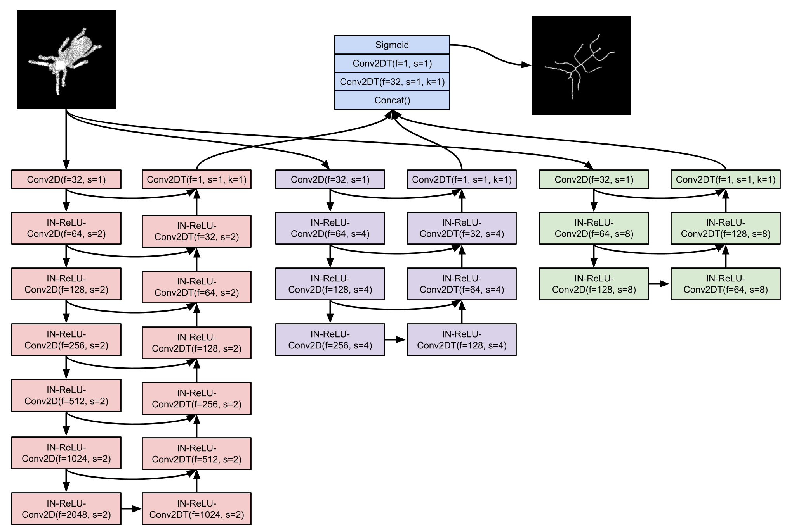
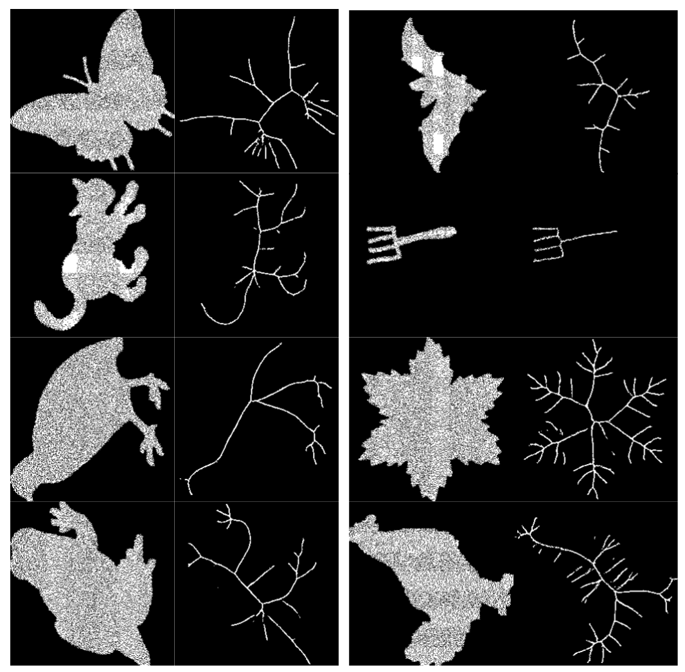

# PSPU-SkelNet
**[Pyramid U-Network for Skeleton Extraction from Shape Points](http://openaccess.thecvf.com/content_CVPRW_2019/papers/SkelNetOn/Atienza_Pyramid_U-Network_for_Skeleton_Extraction_From_Shape_Points_CVPRW_2019_paper.pdf)** to be presented at [2019 CVPR Workshop](http://ubee.enseeiht.fr/skelneton/index.html).

This is the code implementation of the solution in the Point SkelNetOn CVPR 2019 Challenge. TeamPH ranked 3rd with Chamfer Distance score of 2.9105.

## Dataset
- The dataset is assumed to be at subdirectory `dataset/point`. So `mkdir dataset/point`.
- Download compressed train dataset [here](https://drive.google.com/file/d/1XbhSn7mQ-ziuOUi-1rq3vIIF1FNgsaQH/view?usp=sharing). 
- Copy in `skelnet` directory.
- Extract by running `tar zxvf npy.tar.gz` inside `skelnet` directory.
- Download image version of final test images [here](https://drive.google.com/file/d/1Q6NMO1nqHNHl-jF-O8GJbFuN9QQ3c0_R/view?usp=sharing)
- Copy in `dataset/point` and extract by running `tar zxvf weights.tar.gz`.

## Make predictions using pre-trained weights
- Download compressed weights [here](https://drive.google.com/file/d/1wF9UsTmjmxBb2El_CNpWoVn1R_zua2L0/view?usp=sharing)
- Copy in `skelnet` directory.
- Extract by running `tar zxvf weights.tar.gz` inside `skelnet` directory.
- Run prediction: `python3 pspu_skelnet.py --weights=weights/pspu_skelnet.h5`
- View predictions in folder `dataset/point/root`
- To convert predicted images to point cloud run: `python3 img2pt.py`

## Train the model
- Train the model from scratch: `python3 pspu_skelnet.py --train`
- Alternatively, train the model from pre-trained weights: `python3 pspu_skelnet.py --train --weights=weights/pspu_skelnet.h5`


## Network Model
The network is a pyramid of 3 U-Networks. U-Network is commonly used in image translation problems while pyramid structure is used for discovering different levels of feature maps.



## Sample skeleton detection on test split


## Citation
If you find this work useful, please cite:

```
@InProceedings{Atienza_2019_CVPR_Workshops,
author = {Atienza, Rowel},
title = {Pyramid U-Network for Skeleton Extraction From Shape Points},
booktitle = {The IEEE Conference on Computer Vision and Pattern Recognition (CVPR) Workshops},
month = {June},
year = {2019}
}
```
